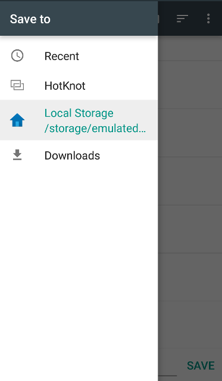

Cordova FileChooser Plugin

Requires Cordova >= 2.8.0

Install with Cordova CLI
	
	$ cordova plugin add http://github.com/don/cordova-filechooser.git

Install with Plugman 

	$ plugman --platform android --project /path/to/project \ 
		--plugin http://github.com/don/cordova-filechooser.git

API

	fileChooser.open(successCallback, failureCallback);

The success callback get the uri of the selected file

	fileChooser.open(function(uri) {
		alert(uri);
	});
	
Screenshot

	fileChooser.create(successCallback, failureCallback);

The success callback will receive the uri of the *created* file.  

NOTES:
	- this file *is* created already, once your callback is triggered.
	- the returned URI is a funky content://XYZ/%2Fencoded%2FURI%2FtoFile

WARNINGS:
	- when you want to write a file, you will have to delete or overwrite the created file, should double check that it is indeed a file (and not a directory) and that it is indeed empty before overwriting (or prompt the user before continue, etc).

TODO rename `open` to pick, select, or choose.
TODO allow users to pass in suggested file name and mime-type to `create`.

