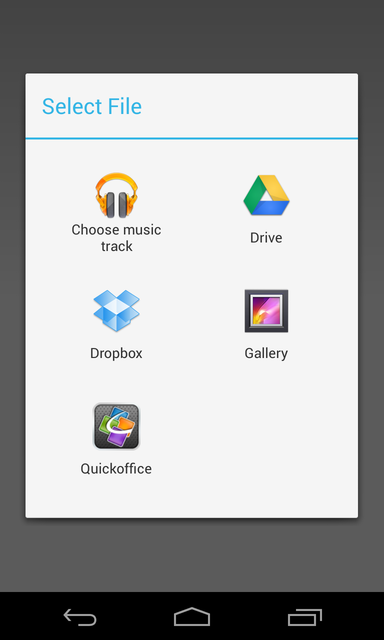

# Cordova FileChooser Plugin

Requires Cordova >= 2.8.0

## Install with Cordova CLI
	$ cordova plugin add http://github.com/ihadeed/cordova-filechooser.git

## Install with Plugman
	$ plugman --platform android --project /path/to/project \ 
		--plugin http://github.com/ihadeed/cordova-filechooser.git

## API

```javascript
fileChooser.open(filter, successCallback, failureCallback); // with mime filter

fileChooser.open(successCallback. failureCallback); // without mime filter
```

### Filter (Optional)

```javascript
{ "mime": "application/pdf" }  // text/plain, image/png, image/jpeg, audio/wav etc
```

The success callback gets the uri of the selected file

```javascript
fileChooser.open(function(uri) {
  alert(uri);
});
```

## Screenshot



## Supported Platforms

- Android
- Windows (UWP)

TODO rename `open` to pick, select, or choose.
